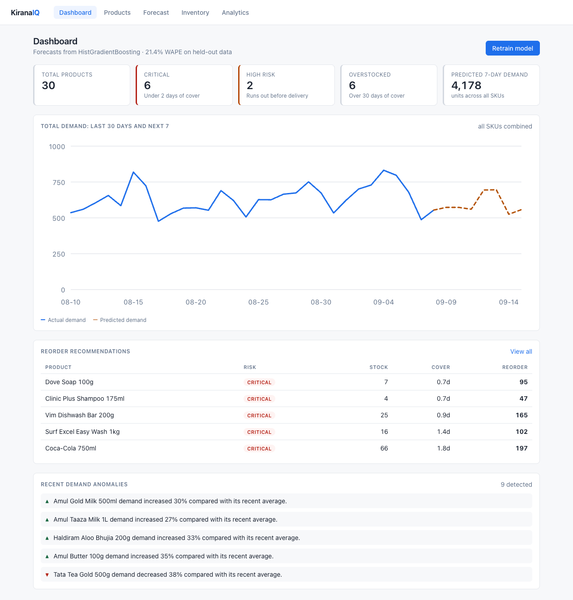
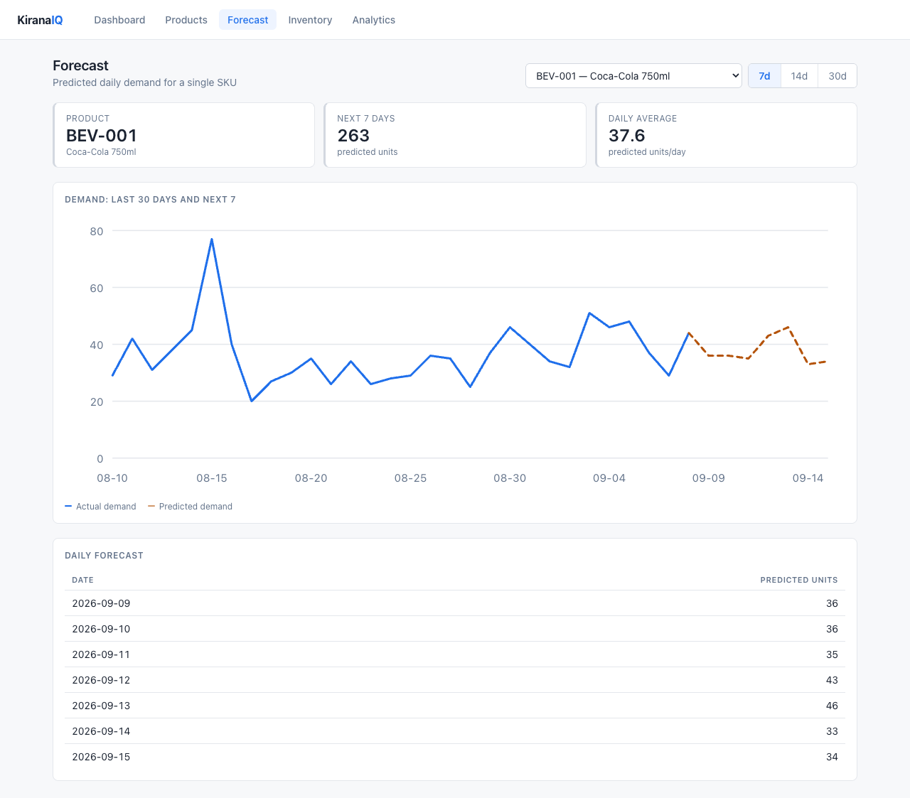
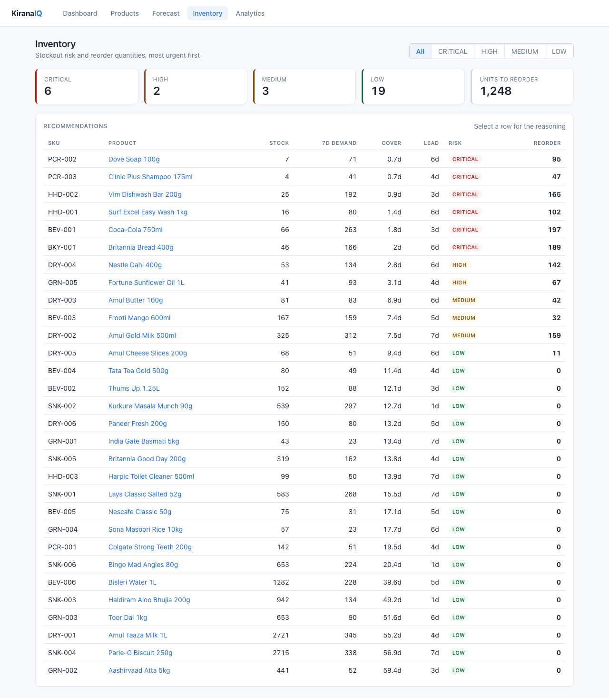
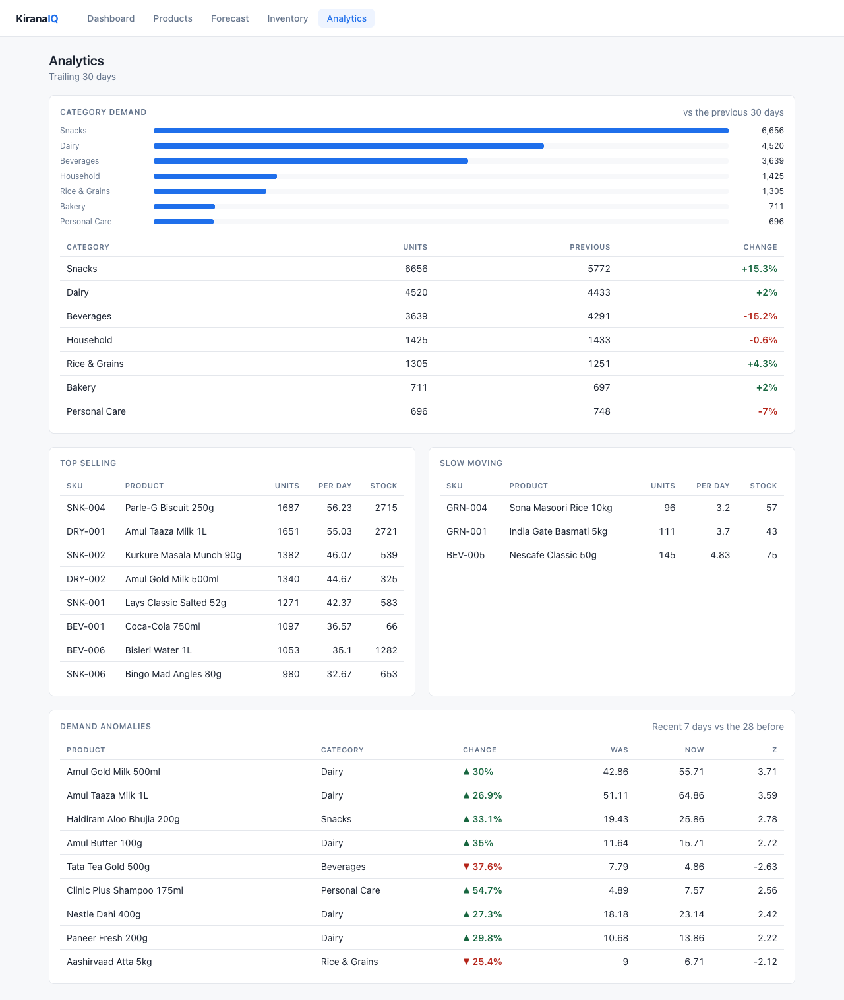
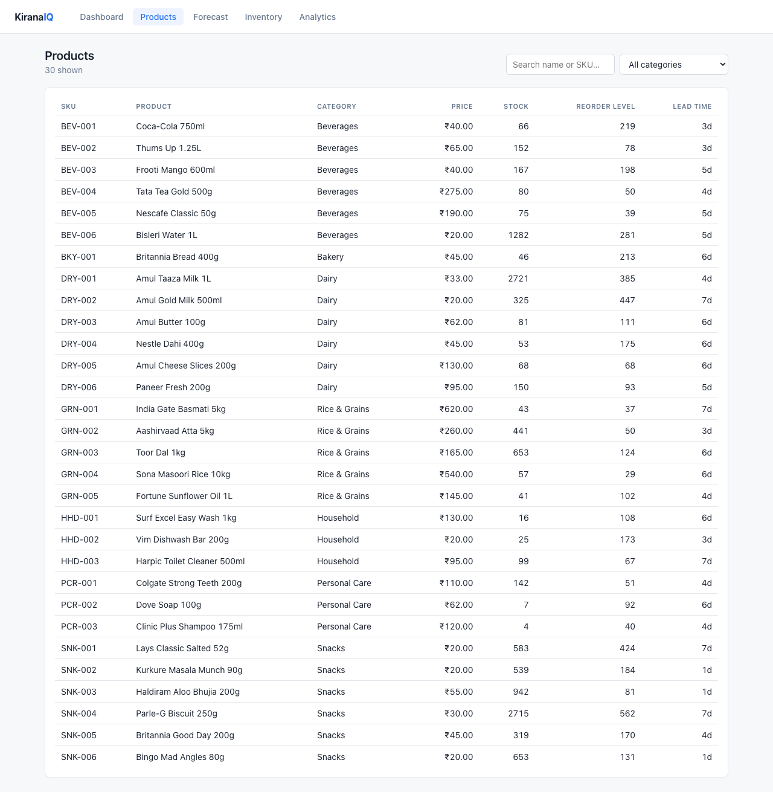

# Kirana-IQ

AI-powered inventory forecasting system for small retail/kirana stores. Kirana-IQ
analyses historical sales data, forecasts SKU-level demand, and turns those
forecasts into concrete inventory decisions: stockout risk, reorder quantities,
and overstock alerts.

> **Status: complete.** Every phase is built and running: data generation,
> feature engineering, model training and evaluation, forecasting, inventory
> intelligence, anomaly detection, analytics, and a five-page React dashboard.
> 181 backend tests pass and all five pages render against the live API. Every
> metric below was measured on this repository, not estimated.

---

## Project Overview

Kirana-IQ is an end-to-end demand forecasting system for a small retail store.
It learns from a shop's own sales history, predicts how much of each SKU will
sell over the next 7, 14 or 30 days, and converts those predictions into the
decision a shop owner actually has to make: what to reorder, how much, and how
urgently.

The emphasis is on the full pipeline being real. The dataset is generated from
explicit, inspectable demand components; the model is evaluated against a
moving-average baseline on a chronologically held-out window; the inventory
maths is standard textbook safety-stock theory; and every number in this README
was measured by running the code in this repository.

## Features

- **Synthetic dataset generator** — 30 SKUs, 7 categories, 365 days, reproducible from a seed
- **Festival calendar** — 18 Indian events with per-category impact scores, used as forecasting features
- **26 engineered features** — calendar, lag, rolling, trend, price and event signals, with leakage guards enforced by tests
- **Two-candidate model selection** — RandomForest vs HistGradientBoosting, chosen on a validation window
- **Honest evaluation** — MAE / RMSE / WAPE against a moving-average baseline, plus a recursive horizon backtest
- **Multi-horizon forecasting** — 7, 14 and 30 days, clipped at zero
- **Stockout risk** — a four-level ladder measured relative to each supplier's lead time
- **Reorder recommendations** — lead-time demand plus variability-based safety stock, with a plain-language reason
- **Overstock detection** — capital tied up beyond 30 days of cover
- **Anomaly detection** — rolling statistics with a dual percentage/z-score gate, no second model
- **Analytics** — top sellers, slow movers, category trends, catalogue-wide demand curve
- **Five-page React dashboard** — with charts drawn as inline SVG
- **181 backend tests + 20 frontend tests**, and CI that fails if any test is skipped

## Problem Statement

A kirana store owner orders stock from intuition. That produces two costly
failures at once: fast-moving SKUs run out before the supplier's next delivery,
while slow-moving SKUs tie up working capital on the shelf. The owner cannot
answer, with numbers:

- What will likely sell over the next 7 days?
- Which products will run out before replenishment arrives?
- Which products are overstocked?
- How much should I reorder, and when?
- Which products are behaving unusually?

Kirana-IQ answers these from the store's own sales history.

## Core Pipeline

```
Historical Sales Data
        |
   Data Cleaning
        |
Feature Engineering
        |
 Machine Learning Model
        |
  Demand Forecast
        |
 Inventory Analysis
        |
  Stockout Risk
        |
Reorder Recommendation
        |
  React Dashboard
```

## Architecture

```
                    ┌──────────────────────────────┐
   Browser  ───────▶│  React SPA  (Vite, port 5173)│
                    │  5 pages · inline-SVG charts │
                    └──────────────┬───────────────┘
                                   │  JSON over HTTP
                    ┌──────────────▼───────────────┐
                    │  FastAPI      (port 8000)    │
                    │  routes/  request validation │
                    ├──────────────────────────────┤
                    │  services/                   │
                    │   forecast · inventory ·     │
                    │   analytics   (+ cache)      │
                    ├──────────────┬───────────────┤
                    │  ml/         │  models/      │
                    │  features    │  SQL access   │
                    │  train       │  (psycopg 3,  │
                    │  predict     │   no ORM)     │
                    │  evaluate    │               │
                    └──────┬───────┴───────┬───────┘
                           │               │
                  ┌────────▼──────┐  ┌─────▼──────────┐
                  │ models/*.joblib│  │  PostgreSQL 16 │
                  │ trained model  │  │ products·sales │
                  └────────────────┘  └────────────────┘
```

Layering is strict and one-directional: `routes` validate and shape HTTP,
`services` hold business logic and orchestration, `ml` is pure computation over
DataFrames, and `models` is the only place SQL is written. Nothing in `ml`
imports a route; nothing in `routes` writes SQL.

That separation is what makes the pipeline testable — feature engineering and
the inventory maths are exercised directly with hand-built inputs, without a
database or an HTTP client anywhere near them.

## Tech Stack

| Layer     | Technology                          |
| --------- | ----------------------------------- |
| Frontend  | React 18, Vite                      |
| Backend   | FastAPI, Uvicorn                    |
| Database  | PostgreSQL 16 (via psycopg 3, no ORM) |
| ML / Data | Python, scikit-learn, Pandas, NumPy |
| Tooling   | Docker, Docker Compose, GitHub Actions |

The database layer is deliberately a thin SQL wrapper around a psycopg
connection pool rather than an ORM, so every query in the project is readable
SQL.

## Data Model

**products** — `id`, `sku`, `name`, `category`, `unit_price`, `current_stock`,
`reorder_level`, `lead_time_days`

**sales** — `id`, `product_id` → `products.id`, `quantity`, `sale_date`,
`unit_price`

One product has many sales. The schema lives in
[backend/app/schema.sql](backend/app/schema.sql) and is applied idempotently at
application startup.

## Dataset

The repository ships a reproducible generator rather than a checked-in dump, so
the dataset can be regenerated or resized at will.

```bash
python scripts/generate_data.py            # defaults: --seed 42 --days 365
python scripts/load_data.py --truncate     # load the CSVs into PostgreSQL
```

Running with the defaults produces:

| Property   | Value                                |
| ---------- | ------------------------------------ |
| Products   | 30 SKUs                              |
| Categories | 7 (Dairy, Snacks, Beverages, Rice & Grains, Personal Care, Household, Bakery) |
| Period     | 2025-09-09 → 2026-09-08 (365 days)   |
| Sales rows | 10,902 (one row per product per day with sales) |
| Total units| 227,468                              |

Demand for a product on a day is a Poisson draw whose mean is built from
interpretable multiplicative components:

```
lambda = base_demand
         x day_of_week_factor    weekend uplift, category dependent
         x seasonal_factor       annual sine wave, peaks in the category's month
         x trend_factor          linear growth or decline across the window
         x event_factor          festival spikes from data/events.csv
         x payday_factor         month-start salary effect
```

Because each component is explicit, the series contains structure a model can
actually learn. Measured on the default seed:

| Signal                    | Evidence in the generated data                |
| ------------------------- | --------------------------------------------- |
| Weekend effect            | Sat/Sun average 725 units vs. weekday 583 (1.24x) |
| Festival spike            | Snacks around Diwali: 224 → 408 daily units (+82%) |
| Seasonality               | Beverages: 122 units/day in January vs. 186 in May |
| Inventory mix             | 8 SKUs under 3 days of cover, 16 healthy, 6 over 30 days |

`--seed` makes runs byte-identical; a different seed produces a different store.

### Event Signals

[data/events.csv](data/events.csv) holds 45 rows covering Indian festivals in the
generated window — Navratri, Dussehra, Diwali, Chhath Puja, Christmas, New Year,
Sankranti, Republic Day, Maha Shivaratri, Holi, Ugadi, Eid al-Fitr, Ram Navami,
Tamil New Year, Eid al-Adha, Independence Day, Raksha Bandhan and Janmashtami.

```csv
date,event_name,affected_category,impact_score
2025-10-20,Diwali,Household,0.60
2026-03-04,Holi,Snacks,0.55
```

One event can have several rows, one per affected category, so Diwali can lift
Household by 60% and Rice & Grains by 40%. `affected_category` may be `ALL`.
Uplift ramps over the three days *before* the event (shoppers stock up in
advance) and decays the day after.

Festival dates are approximate — several are lunar and shift year to year. The
file is a plain CSV read at generation time, so a real calendar API can replace
it later without touching the generator.

## Feature Engineering

26 features per product-day, built with Pandas and NumPy in
[feature_engineering.py](backend/app/ml/feature_engineering.py).

| Group    | Features |
| -------- | -------- |
| Calendar | `day_of_week`, `month`, `day_of_month`, `is_weekend` |
| Lags     | `lag_1`, `lag_7`, `lag_14`, `lag_30` |
| Rolling  | `rolling_mean_7`, `rolling_mean_14`, `rolling_mean_30`, `rolling_std_7` |
| Trend    | `recent_7_day_growth`, `recent_30_day_growth` |
| Product  | `unit_price`, `category` (one-hot, 7 columns) |
| Events   | `festival_flag`, `festival_impact`, `festival_impact_upcoming`, `promotion_flag` |

### Avoiding Leakage

One rule governs the module: **a feature for date D may only use information
available before the end of D-1.** Every lag and rolling statistic is computed
on `quantity.shift(1)` *before* any window is applied:

```python
past = frame["quantity"].shift(1)
frame["rolling_mean_7"] = past.rolling(7).mean()   # days D-7 .. D-1
frame["rolling_std_7"]  = past.rolling(7).std()
```

Writing `rolling(7)` without the shift would include day D's own sales in the
feature used to predict day D. The model would score beautifully and be useless
in production. Two tests pin this down: changing day D's quantity must not
change day D's features, and appending later days must not change an earlier
day's features.

The festival calendar is the deliberate exception. Diwali's date is known months
ahead, so `festival_impact_upcoming` — the strongest event in the next three
days — looks forward on purpose. That is not leakage; it is what a shop owner
does when ordering.

Three further details that matter:

- **Zero-fill before windowing.** The sales table only stores days that had
  sales. A missing day is a real zero, not missing data, so each series is
  reindexed onto a complete calendar first. Skipping this would teach the model
  that demand never drops to nothing.
- **Growth guarded against division by zero.** A product that sold nothing in
  the earlier window has undefined growth; it is reported as `0.0` rather than
  infinity.
- **History measured in days, not rows.** A product with many zero-sale days has
  fewer rows than days. Lag windows care about days, so the sufficiency check
  uses the calendar span.

## ML Model

A **single global model across all 30 SKUs**, not one model per product. The lag
and rolling features already carry each product's scale, so a shared model
learns the weekly and festival patterns from 30x more rows and can serve a new
SKU as soon as it has 31 days of history.

Two scikit-learn candidates are trained and compared:

- `RandomForestRegressor` (300 trees, max_depth 14)
- `HistGradientBoostingRegressor` (400 iterations, lr 0.06, early stopping)

Training uses a **chronological 70/15/15 split** — never `train_test_split` with
shuffling, which would let the model train on next week to predict last week.
Cut points are chosen on sorted unique dates so every product splits at the same
two moments. The winner is selected on the validation window; the test window is
untouched until the choice is fixed. Predictions are clipped at zero.

```bash
cd backend && python -m app.ml.train_model
```

Longer horizons are produced **recursively**: predict tomorrow, append that
prediction to the history as if observed, rebuild the lag features, predict the
next day. 7, 14 and 30-day horizons are supported.

## Model Evaluation

MAE and RMSE are in units. WAPE is `sum|error| / sum(actual)` — used instead of
MAPE because demand series contain zero-sale days, where MAPE divides by zero.

Dataset: 10,050 product-days across 30 SKUs.
Train `2025-10-09 → 2026-05-30` (7,020) · Validation `2026-05-31 → 2026-07-19`
(1,500) · Test `2026-07-20 → 2026-09-08` (1,530).

**Validation — model selection**

| Model                  |   MAE |  RMSE |   WAPE |
| ---------------------- | ----- | ----- | ------ |
| Moving Average (7d)    | 4.836 | 6.922 | 22.92% |
| Random Forest          | 4.327 | 6.033 | 20.51% |
| HistGradientBoosting   | 4.230 | 5.960 | **20.05%** |

**Test — held out, HistGradientBoosting selected**

| Model                  |   MAE |  RMSE |   WAPE |
| ---------------------- | ----- | ----- | ------ |
| Moving Average (7d)    | 5.062 | 7.526 | 24.27% |
| HistGradientBoosting   | 4.474 | 6.533 | **21.45%** |

**11.6% lower WAPE than the baseline.**

### Horizon Backtest

Next-day accuracy is not what the product promises, so recursive forecasting is
backtested at real horizons — 6 origin dates per SKU, each forecasting forward
and compared against what actually happened. The baseline here is flat: a
moving average predicts the same number for day 1 and day 30.

```bash
cd backend && python -m app.ml.evaluate
```

| Horizon | Predictions | Baseline WAPE | Model WAPE | Improvement |
| ------- | ----------- | ------------- | ---------- | ----------- |
| 7 days  | 1,260       | 24.62%        | 20.54%     | 16.6%       |
| 14 days | 2,520       | 24.03%        | 20.19%     | 16.0%       |
| 30 days | 5,400       | 23.63%        | 19.82%     | 16.1%       |

Error growth across the 7-day horizon:

| Step | Baseline WAPE | Model WAPE | Model MAE |
| ---- | ------------- | ---------- | --------- |
| 1    | 22.15%        | 19.95%     | 4.11      |
| 2    | 21.58%        | 21.07%     | 4.41      |
| 3    | 24.68%        | 19.02%     | 3.97      |
| 4    | 27.08%        | 19.94%     | 5.08      |
| 5    | 21.55%        | 19.11%     | 4.32      |
| 6    | 31.95%        | 23.60%     | 4.14      |
| 7    | 24.21%        | 21.90%     | 4.26      |

Accuracy does **not** decay meaningfully across the horizon, which is worth
being precise about rather than claiming as a win. Recursive forecasting usually
compounds error. It does not here because this demand is dominated by
day-to-day noise around a stable seasonal mean, so the model is effectively
predicting a well-calibrated seasonal average — and that average is just as
valid on day 7 as on day 1. On a series with real momentum, these numbers would
degrade with horizon.

### How much accuracy is actually available?

Demand in the generated data is a Poisson draw, so even an oracle that knew each
product's true mean exactly would still miss by the sampling noise. For a
Poisson variable, `E|X - λ| ≈ sqrt(2λ/π)`, which puts a floor under any model:

| | WAPE |
| --- | --- |
| Moving-average baseline | 24.62% |
| **HistGradientBoosting** | **20.54%** |
| Irreducible noise floor (approximate) | 16.30% |

The model closes roughly **half the gap** between the baseline and the best any
forecaster could do. The remaining 4 points are mostly unlearnable randomness,
not a tuning opportunity — which is the honest reason not to reach for a bigger
model here.

## Inventory Recommendation Logic

A forecast alone tells a shop owner nothing actionable. This layer converts
predicted demand into an order quantity with a reason attached, in
[inventory_service.py](backend/app/services/inventory_service.py).

### Stock cover

```
average_daily_demand = mean(predicted demand over the horizon)
stock_cover_days     = current_stock / average_daily_demand
```

`stock_cover_days` is `null` when nothing is predicted to sell — undefined, not
infinite, and handled explicitly everywhere downstream.

### Stockout risk

Risk is **relative to the supplier's lead time**, which is the whole point:
five days of cover is comfortable with a next-day supplier and a stockout
waiting to happen with a weekly one.

| Level | Condition |
| ----- | --------- |
| `CRITICAL` | cover <= 2 days (regardless of lead time) |
| `HIGH`     | cover <= `lead_time_days` — will run out before the delivery lands |
| `MEDIUM`   | cover <= `lead_time_days + 3` |
| `LOW`      | otherwise |

Every threshold is a business decision, not a law, so all of them are
environment-configurable (`CRITICAL_COVER_DAYS`, `MEDIUM_COVER_BUFFER_DAYS`,
`OVERSTOCK_COVER_DAYS`, `SAFETY_DAYS`, `SERVICE_LEVEL_Z`).

### Reorder quantity

```
replenishment_window = lead_time_days + safety_days
lead_time_demand     = sum(forecast over replenishment_window)
safety_stock         = z x sigma_daily x sqrt(replenishment_window)
target_stock         = lead_time_demand + safety_stock
reorder_quantity     = max(0, target_stock - current_stock)
```

Two details that matter:

- **Safety stock scales with `sqrt(days)`, not `days`.** Forecast error
  accumulates with the square root of time, so a 9-day window needs 3x the
  buffer of a 1-day window, not 9x. `z = 1.28` corresponds to roughly a 90%
  service level.
- **Volatility changes the order.** Two products with identical average demand
  get different recommendations if one sells erratically — sigma is measured on a
  zero-filled calendar, so quiet days count.

Overstocked products are never told to reorder, whatever the arithmetic says.

### Overstock

Cover beyond 30 days is flagged as capital tied up on the shelf. A product with
stock but no predicted demand is also overstocked — infinite cover.

### Worked example

Live output from `GET /inventory/recommendations` on the sample dataset:

```json
{
  "sku": "PCR-002",
  "name": "Dove Soap 100g",
  "current_stock": 7,
  "expected_7_day_demand": 71.0,
  "average_daily_demand": 10.1,
  "stock_cover_days": 0.7,
  "lead_time_days": 6,
  "risk": "CRITICAL",
  "safety_stock": 9.6,
  "recommended_reorder_quantity": 95,
  "reason": "Only 0.7 days of stock left and the supplier takes 6 days. This product will very likely run out before replenishment arrives — reorder 95 units now."
}
```

Across the 30-SKU sample catalogue: **6 critical, 2 high, 3 medium, 19 low
risk, 6 overstocked**, 1,248 units recommended for reorder.

### Performance

Recursive forecasting costs a model call and a feature rebuild per predicted
day, so a whole-catalogue assessment is seconds of work, not milliseconds.
Results are cached in process and invalidated by the only two things that can
change them — a new sale for that product, or a retrained model:

| Request | Cold | Cached |
| ------- | ---- | ------ |
| `GET /inventory/recommendations` (30 SKUs) | 1.79 s | 0.07 s |

## API Endpoints

Implemented today:

| Method | Path                        | Description                                       |
| ------ | --------------------------- | ------------------------------------------------- |
| GET    | `/`                         | Service name, version, link to docs               |
| GET    | `/health`                   | Liveness probe; reports PostgreSQL connectivity   |
| GET    | `/docs`                     | Interactive OpenAPI documentation                 |
| GET    | `/products`                 | List products; `category`, `search`, `limit`, `offset` |
| GET    | `/products/categories`      | Distinct categories, for the dashboard filter     |
| GET    | `/products/{id}`            | One product; 404 when absent                      |
| POST   | `/products`                 | Create a product; 409 on duplicate SKU            |
| GET    | `/sales/{product_id}`       | Sales history; `start_date`, `end_date`, `limit`  |
| GET    | `/sales/{product_id}/summary` | Record count, total units, first/last sale date |
| POST   | `/sales`                    | Record a sale; 404 when the product is unknown    |
| GET    | `/forecast/{id}?days=7`     | Daily demand forecast (7/14/30) plus recent history |
| GET    | `/model`                    | Which model is serving, when trained, how it scored |
| POST   | `/train`                    | Retrain on current data and reload the serving model |
| GET    | `/inventory/recommendations`| Reorder recommendations, most urgent first; `risk` filter |
| GET    | `/inventory/summary`        | Headline counts for the dashboard cards           |
| GET    | `/inventory/{id}`           | Inventory assessment for one product              |
| GET    | `/analytics/overview`       | Dashboard payload: counts, anomalies, top reorders |
| GET    | `/analytics/anomalies`      | Products deviating from their own recent baseline |
| GET    | `/analytics/demand-trend`   | Catalogue-wide actual demand followed by forecast |
| GET    | `/analytics/top-products`   | Best sellers over a trailing window               |
| GET    | `/analytics/slow-moving`    | Products well below catalogue average             |
| GET    | `/analytics/category-trends`| Category demand vs the previous window            |

Example `/health` response:

```json
{
  "status": "ok",
  "app": "Kirana-IQ",
  "version": "0.1.0",
  "environment": "development",
  "database": "connected"
}
```

`status` is `degraded` and `database` is `unavailable` when PostgreSQL cannot be
reached; the API stays up so the failure is visible rather than fatal.

Example — `GET /sales/1?start_date=2026-09-01`:

```json
[
  { "id": 1, "product_id": 1, "quantity": 55, "sale_date": "2026-09-01", "unit_price": "33.00" },
  { "id": 2, "product_id": 1, "quantity": 66, "sale_date": "2026-09-02", "unit_price": "33.00" }
]
```

Validation is enforced at the edge by Pydantic: negative prices, negative
quantities, malformed dates and inverted date ranges return `422`; unknown ids
return `404`; duplicate SKUs return `409`.

Example — `GET /forecast/1?days=7`:

```json
{
  "product_id": 1,
  "sku": "DRY-001",
  "name": "Amul Taaza Milk 1L",
  "forecast_days": 7,
  "total_predicted_demand": 345,
  "forecast": [
    { "date": "2026-09-09", "predicted_demand": 47 },
    { "date": "2026-09-12", "predicted_demand": 56 },
    { "date": "2026-09-13", "predicted_demand": 60 }
  ],
  "history": [{ "date": "2026-09-08", "quantity": 36 }]
}
```

The weekend uplift the model learned is visible in the raw output: Saturday the
12th and Sunday the 13th are forecast well above the surrounding weekdays.

`days` accepts only 7, 14 or 30; anything else returns `422`. A forecast
requested before any model is trained returns `503`, and a product with less
than 31 days of history returns `422`.

All analytics windows are anchored to the most recent sale date in the
database, not to today. The sample dataset ends at a fixed point, and anchoring
to `CURRENT_DATE` would silently return empty results the day after generation.

## Demand Anomalies

Anomaly detection compares each product's last 7 days against the 28 days
before it — Pandas and NumPy, no second model. A trained model would add opacity
without adding accuracy to the question "is this week unusual for this product?"

A change must clear **two** gates to be reported:

| Gate | Default | Why |
| ---- | ------- | --- |
| Relative change | >= 25% | Statistical significance alone flags trivial moves on very steady products |
| z-score | >= 2.0 | Percentage alone fires constantly on low-volume or erratic products |

`z = (recent_mean - baseline_mean) / (baseline_std / sqrt(7))` — the standard
error of a 7-day mean. The practical effect: the same 40% jump is an anomaly for
a steady seller and normal noise for an erratic one, which is exactly the
distinction a shop owner cares about.

Live output on the sample dataset:

```
▲ Amul Gold Milk 500ml demand increased 30% compared with its recent average.   z=3.71
▲ Amul Taaza Milk 1L demand increased 27% compared with its recent average.     z=3.59
▲ Amul Butter 100g demand increased 35% compared with its recent average.       z=2.72
▼ Tata Tea Gold 500g demand decreased 38% compared with its recent average.     z=-2.63
```

That Dairy cluster is not a coincidence: Janmashtami falls on 2026-09-04, inside
the recent window, and the generator gives Dairy a 0.45 impact score for it. The
detector is recovering a signal that was genuinely planted — a useful end-to-end
check that the pipeline works.

Edge cases handled explicitly: a product selling nothing in the baseline window
reports `change_pct: null` with a worded message rather than dividing by zero,
and days missing from the sales table count as real zeros rather than being
skipped.

## Dashboard

Five pages, built with React and React Router. Charts are hand-rolled inline
SVG — the project needs two chart types, and a charting library would have been
more code than the two components it replaced.

| Page | Contents |
| ---- | -------- |
| **Dashboard** | Five headline cards, catalogue-wide demand chart (30 days actual + 7 forecast), top reorder recommendations, recent anomalies, and a Retrain button |
| **Products** | Full catalogue with live search and category filter |
| **Forecast** | Per-SKU forecast at 7/14/30 days, chart joining actual to predicted, daily table |
| **Inventory** | Risk-sorted recommendations; click a product for the reasoning, safety stock and target stock |
| **Analytics** | Category demand vs the previous window, top sellers, slow movers, anomaly table |

The design is deliberately plain: neutral greys, one accent colour, muted risk
badges, no animation. Loading, error and empty states are handled on every page,
and a `503` from an untrained model renders as "No model trained yet" with
instructions rather than a stack trace.

Every page was verified rendering against the live API in headless Chrome — that
check caught two real bugs a build could not: a forecast line drawn off the
right edge of the chart because the x-axis was scaled to the longest series
rather than the furthest offset, and axis labels reading 213/425/638 instead of
round numbers.

### Screenshots

All screenshots are live renders against the running API — real model output,
not mockups.

**Dashboard** — headline cards, catalogue demand (30 days actual + 7 forecast),
reorder recommendations, recent anomalies.



**Forecast** — per-SKU horizon selection, actual demand joined to the predicted
continuation. The weekend uplift the model learned is visible in the dashed line.



**Inventory** — risk-sorted reorder table; selecting a product reveals the
reasoning, safety stock and target stock.



**Analytics** — category demand versus the previous window, top sellers, slow
movers, and the anomaly table.



**Products** — the catalogue with live search and category filtering.



## Installation

### Option A — Docker (recommended)

```bash
git clone <repository-url>
cd Kirana-IQ
cp .env.example .env
docker compose up --build
```

Then seed the database (in a second terminal):

```bash
python scripts/generate_data.py
python scripts/load_data.py --truncate

cd backend
python -m app.ml.train_model    # trains and saves models/demand_model.joblib
python -m app.ml.evaluate       # horizon backtest
```

Services:

- Frontend — http://localhost:5173
- Backend — http://localhost:8000 (docs at http://localhost:8000/docs)
- PostgreSQL — `localhost:5432`

### Option B — Local development

PostgreSQL must be reachable. The quickest way is to run just the database
container:

```bash
docker compose up -d db
```

Backend:

```bash
python3 -m venv .venv
source .venv/bin/activate
pip install -r backend/requirements.txt
cd backend
uvicorn app.main:app --reload --port 8000
```

Frontend:

```bash
cd frontend
npm install
npm run dev
```

### Environment Variables

Copy `.env.example` to `.env` at the repository root. All backend settings are
read from the environment via `pydantic-settings`.

| Variable            | Default                 | Purpose                              |
| ------------------- | ----------------------- | ------------------------------------ |
| `ENVIRONMENT`       | `development`           | Reported by `/health`                |
| `POSTGRES_HOST`     | `localhost`             | Database host (`db` inside Docker)   |
| `POSTGRES_PORT`     | `5432`                  | Database port                        |
| `POSTGRES_DB`       | `kirana_iq`             | Database name                        |
| `POSTGRES_USER`     | `kirana`                | Database user                        |
| `POSTGRES_PASSWORD` | `kirana`                | Database password                    |
| `CORS_ORIGINS`      | `http://localhost:5173` | Comma-separated allowed origins      |
| `DATA_DIR`          | `<repo>/data`           | Where CSVs live (Docker sets `/data`) |
| `MODEL_DIR`         | `<repo>/models`         | Where models are saved (Docker: `/models`) |
| `CRITICAL_COVER_DAYS` | `2.0`                 | Cover at or below this is CRITICAL   |
| `MEDIUM_COVER_BUFFER_DAYS` | `3.0`            | Buffer beyond lead time for MEDIUM   |
| `OVERSTOCK_COVER_DAYS` | `30.0`               | Cover above this is flagged overstock |
| `SAFETY_DAYS`       | `3`                     | Extra demand days held beyond lead time |
| `SERVICE_LEVEL_Z`   | `1.28`                  | Safety-stock multiplier (~90% service) |
| `ANOMALY_RECENT_DAYS` | `7`                   | Recent window compared against the baseline |
| `ANOMALY_BASELINE_DAYS` | `28`                | Baseline window length               |
| `ANOMALY_MIN_CHANGE` | `0.25`                 | Minimum relative change to report    |
| `ANOMALY_MIN_ZSCORE` | `2.0`                  | Minimum z-score to report            |
| `VITE_API_BASE_URL` | `http://localhost:8000` | API base URL baked into the frontend |

## Docker Setup

Two stacks share one base file.

**Development** (default) mounts the source into both containers, so backend
edits reload via uvicorn and frontend edits reload via Vite:

```bash
docker compose up --build
```

**Production** drops the mounts and reloaders, so each container runs exactly
what its Dockerfile built and the frontend is served from a built bundle:

```bash
docker compose -f docker-compose.yml -f docker-compose.prod.yml up --build
```

| Service    | Image             | Port | Notes |
| ---------- | ----------------- | ---- | ----- |
| `db`       | postgres:16-alpine | 5432 | Named volume; healthcheck gates the backend |
| `backend`  | built from `backend/` | 8000 | Waits for `service_healthy` before starting |
| `frontend` | built from `frontend/` | 5173 | Talks to the API from the browser, so it uses `localhost:8000` |

Two details worth knowing:

- **Volumes mount outside `/app`.** The data and model volumes live at `/data`
  and `/models`, with `DATA_DIR` / `MODEL_DIR` pointing at them. Nesting a volume
  inside the bind-mounted source directory makes Docker create empty stub
  directories on the host.
- **`node_modules` is an anonymous volume.** The frontend mounts source but keeps
  the container's own `node_modules`, so its Linux-native binaries (esbuild,
  rollup) are not shadowed by the host's macOS builds.

Useful commands:

```bash
docker compose logs -f backend     # follow API logs
docker compose down                # stop
docker compose down -v             # stop and delete the database volume
```

## Testing

```bash
cd backend
pytest -v
```

181 tests, all passing. They need a reachable PostgreSQL (`docker compose up -d db`)
and clean up any rows they create. Tests that need a trained model skip rather
than fail when none exists, so a fresh clone can run the suite immediately.

| File                       | Covers                                                     |
| -------------------------- | ---------------------------------------------------------- |
| `test_health.py`           | `/health` shape, `/` root                                  |
| `test_products.py`         | Creation, retrieval, filtering, search, pagination, 404/409/422 |
| `test_sales.py`            | Sale creation, chronological history, date filtering, summary aggregation, validation |
| `test_data_generation.py`  | Reproducibility, unique SKUs, positive integer quantities, weekend uplift, festival uplift, stock-cover mix |
| `test_feature_engineering.py` | **Leakage guards**, lag/rolling alignment, zero-fill, event features, chronological split |
| `test_forecasting.py`      | Metric maths, baseline behaviour, horizon length, zero-clipping, sparse history, determinism |
| `test_training.py`         | Split ordering and proportions, model selection, and that the model beats the baseline |
| `test_inventory.py`        | Risk ladder boundaries, safety-stock formula, reorder arithmetic, overstock, explanations |
| `test_forecast_api.py`     | Every horizon, non-negative predictions, ordering, risk filtering, summary consistency, 404/422/503 |
| `test_analytics.py`        | Anomaly gates, zero-baseline handling, movers, category trends, endpoint validation |

Two groups are worth calling out. The generator tests assert that the synthetic
data actually contains the weekly and festival structure the model is asked to
learn. The leakage tests assert that the model is not allowed to see it too
early — without them, a silent `shift(1)` mistake would inflate every metric in
this README and nothing would fail.

Forecasting tests use a stub regressor, so they run in CI without training
first and they isolate forecasting mechanics from model quality.

### Frontend tests

```bash
cd frontend
npm test
```

20 tests with Vitest and Testing Library, covering the chart geometry and table
rendering. The most useful one is a regression test for a bug found during
development: the forecast line was scaled to the longest series rather than the
furthest offset, so it rendered off the right edge of the chart and never
appeared. Reintroduce that bug and
`LineChart > keeps an offset series inside the plot area` fails.

## Continuous Integration

[.github/workflows/ci.yml](.github/workflows/ci.yml) runs on every push and pull
request to `main`:

- **backend** — starts a PostgreSQL service container, installs requirements,
  generates and loads the dataset, **trains a model**, then runs `pytest`
- **frontend** — `npm install`, `npm test`, `npm run build`

The training step matters. The suite skips model-dependent tests when no model
exists, which is right for a fresh clone and wrong for CI — without it, CI
reported green while running 163 of 181 tests. A final step re-runs the suite and
**fails the build if anything was skipped**, so the environment cannot silently
degrade again.

## Project Structure

```
Kirana-IQ/
├── backend/
│   ├── app/
│   │   ├── main.py            # FastAPI app, CORS, lifespan, /health
│   │   ├── config.py          # Env-driven settings
│   │   ├── database.py        # psycopg connection pool + SQL helpers
│   │   ├── schema.sql         # products / sales DDL
│   │   ├── routes/            # products, sales, forecast, inventory, analytics
│   │   ├── models/            # product.py, sale.py — SQL access functions
│   │   ├── schemas/           # product.py, sale.py — Pydantic models
│   │   ├── services/
│   │   │   ├── forecast_service.py     # orchestration + forecast cache
│   │   │   ├── inventory_service.py    # risk, safety stock, reorder logic
│   │   │   └── analytics_service.py    # anomalies, movers, trends
│   │   └── ml/
│   │       ├── feature_engineering.py  # 26 leakage-free features
│   │       ├── train_model.py          # chronological split, model selection
│   │       ├── predict.py              # recursive multi-day forecasting
│   │       └── evaluate.py             # MAE/RMSE/WAPE, horizon backtest
│   ├── tests/
│   ├── Dockerfile
│   ├── pytest.ini
│   └── requirements.txt
├── frontend/
│   ├── src/
│   │   ├── components/        # Layout, DataTable, StatCard, RiskBadge,
│   │   │                      # LineChart + BarChart (inline SVG), States
│   │   ├── pages/             # Dashboard, Products, Forecast, Inventory, Analytics
│   │   ├── hooks/useApi.js    # loading / error / reload state
│   │   ├── services/api.js    # API client
│   │   ├── App.jsx            # routes
│   │   ├── main.jsx
│   │   └── index.css
│   │   └── test/             # Vitest component tests
│   ├── Dockerfile
│   ├── index.html
│   ├── package.json
│   ├── vite.config.js
│   └── vitest.config.js
├── data/
│   ├── events.csv             # festival calendar (committed)
│   ├── products.csv           # generated, git-ignored
│   └── sales.csv              # generated, git-ignored
├── models/                    # demand_model.joblib, metrics.json (generated)
├── scripts/
│   ├── generate_data.py       # reproducible synthetic dataset
│   └── load_data.py           # CSV -> PostgreSQL via COPY
├── docs/screenshots/          # dashboard images used in this README
├── .github/workflows/ci.yml
├── docker-compose.yml         # development stack (source mounted)
├── docker-compose.prod.yml    # production override (built images)
├── .env.example
└── README.md
```

## Roadmap

| Phase | Scope                                                              |
| ----- | ------------------------------------------------------------------ |
| 1 ✅  | Scaffold: FastAPI, React, PostgreSQL, env config, `/health`, Docker, CI |
| 2 ✅  | Synthetic dataset generator, events dataset, product & sales CRUD endpoints |
| 3 ✅  | Feature engineering, moving-average baseline, scikit-learn model, evaluation |
| 4 ✅  | Forecast API, inventory intelligence, stockout risk, reorder recommendations |
| 5 ✅  | Anomaly detection, analytics endpoints                             |
| 6 ✅  | Full React dashboard: Dashboard, Products, Forecast, Inventory, Analytics |

Model evaluation results (MAE / RMSE / WAPE, baseline vs. ML) will be published
here once phase 3 has actually been trained and measured. No metrics are quoted
before they are produced.

## Known Limitations

Worth stating plainly rather than discovering in a demo:

- **`promotion_flag` is not knowable for future dates.** It is derived from
  realised price, so forecasts assume no promotion. Training uses the real flag;
  serving passes zero.
- **Accuracy is close to the data's noise floor.** See
  [Model Evaluation](#model-evaluation) — roughly 4 WAPE points of the remaining
  error is Poisson randomness, not a tuning opportunity.
- **The horizon backtest does not degrade with distance**, because this demand
  is noise around a stable seasonal mean. Real series with momentum would.
- **Forecasts are cached in process.** A multi-worker deployment would need a
  shared cache; a single container is assumed.
- **`POST /train` is synchronous** (~3 seconds on this dataset). Fine for an
  occasional operation, not for a request-heavy path.

## Future Improvements

- Real event/festival signals from an external calendar API
- Per-category and store-wide aggregate forecasting
- Supplier lead-time learning from actual delivery history
- Prediction intervals rather than point forecasts
- Authentication and multi-store support

## License

See [LICENSE](LICENSE).
